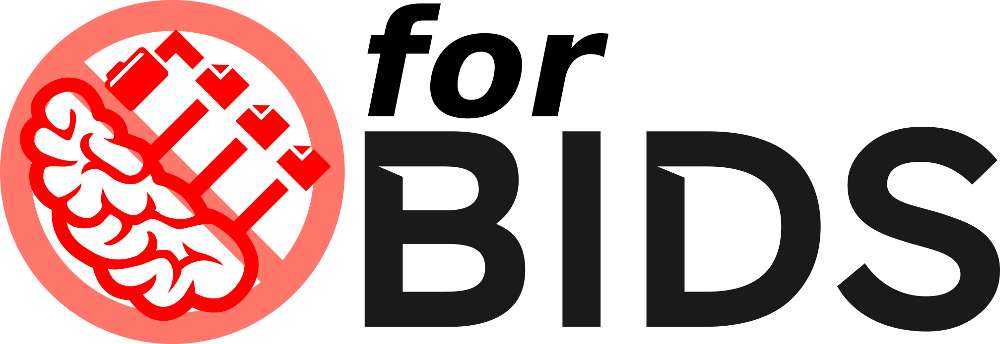

#  forBIDS: a protocol compliance check

forBIDS aims to be a tool for BIDS that forbids deviation from a established acquisition protocol.

It is meant to be ran continuously on session newly converted to BIDS, as a validation before being merged into a dataset.

It aims to check that all planned sequences have been acquired (allowing optional ones), and check that a configured set of sequence parameters match expected values.
It is designed for multi-centric/multi-vendor studies: the sequence parameters constraint can be set conditional to Manufacter/Model/Instrument/SoftwareVersion.

## design

- `forbids init <bids_path>` : create a `.forbids` folder that contains a BIDS-like structure with json schemas for each series in a BIDS dataset with a set of sessions from each scanner.
- `forbids validate <bids_path> --participant-label  [--session-label <ses>]` : validate the subject/session against the schema found in `.forbids` by validating all schema files against the subject/session BIDS files and checking for missing or extra/unwanted BIDS files.
