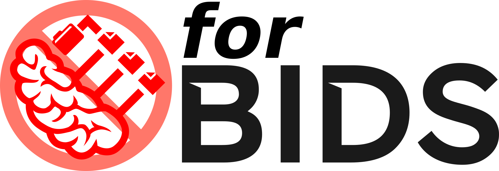

#  forBIDS: Protocol Compliance Validation for BIDS

[](https://opensource.org/licenses/MIT)
[](https://www.python.org/downloads/)

**forBIDS** is a tool for validating BIDS datasets against established acquisition protocols. It ensures that newly acquired neuroimaging data complies with your study's protocol before being merged into your dataset.

## Features

✅ **Protocol Compliance**: Validate that all planned sequences have been acquired
✅ **Metadata Validation**: Check that acquisition parameters match expected values
✅ **Multi-Site Support**: Designed for multi-centric and multi-vendor studies
✅ **Flexible Constraints**: Set validation rules conditional on Manufacturer/Model/Software Version
✅ **Optional Sequences**: Allow optional acquisitions while enforcing required ones
✅ **Run Count Validation**: Ensure correct number of runs per sequence

## Installation

### From PyPI
```bash
pip install forbids
```

### From Source
```bash
git clone https://github.com/UNFMontreal/forbids.git
cd forbids
pip install -e .
```

## Quick Start

### 1. Initialize Schemas

Generate protocol compliance schemas from a reference BIDS dataset:

```bash
forbids init /path/to/reference/bids/dataset
```

This creates a `.forbids` folder containing JSON schemas for each acquisition type.

### 2. Validate New Data

Validate newly acquired data against the generated schemas:

```bash
# Validate a single subject
forbids validate /path/to/bids/dataset --participant-label 01

# Validate multiple subjects
forbids validate /path/to/bids/dataset --participant-label 01 02 03

# Validate specific session
forbids validate /path/to/bids/dataset --participant-label 01 --session-label baseline
```

## Usage

### Initialization Options

```bash
# Basic initialization (uniform across instruments and sessions)
forbids init /path/to/bids/dataset

# Session-specific schemas (for longitudinal studies with protocol changes)
forbids init /path/to/bids/dataset --session-specific

# Scanner-specific schemas (allow different protocols per scanner)
forbids init /path/to/bids/dataset --scanner-specific

# Version-specific schemas (account for software version differences)
forbids init /path/to/bids/dataset --version-specific
```

### Validation Options

```bash
# Validate all subjects
forbids validate /path/to/bids/dataset

# Validate specific subject and session
forbids validate /path/to/bids/dataset \
    --participant-label 01 \
    --session-label baseline
```

## How It Works

1. **Schema Generation** (`init`): Analyzes exemplar BIDS data to create JSON schemas with validation rules
2. **Validation** (`validate`): Checks new data against schemas, reporting:
   - Missing required files
   - Unexpected extra files
   - Metadata values outside expected ranges
   - Incorrect number of runs

## Multi-Site Studies

forBIDS is designed for multi-site and multi-vendor studies. It can:

- Group data by manufacturer and model
- Create unified schemas that work across different scanner instances
- Allow site-specific variations when needed
- Validate data from any site against the same protocol

## Configuration

Validation rules are defined in configuration files (`src/forbids/config/`):

- `=` : Exact match required
- `*` : Any value allowed (wildcard)
- `~=X` : Tolerance of ±X allowed
- `rPATTERN` : Must match regex pattern

Example:
```json
{
  "properties": {
    "EchoTime": "=",           // Must match exactly
    "Manufacturer": "*",        // Any value allowed
    "ImagingFrequency": "~=.5", // Within ±0.5
    "SequenceName": "r^ep2d.*"  // Must match regex
  }
}
```

## Documentation

- **[User Guide](docs/user_guide.md)**: Comprehensive usage guide with examples
- **[API Reference](docs/api_reference.md)**: Detailed API documentation
- **[BIDS Specification](https://bids-specification.readthedocs.io/)**: Official BIDS documentation

## Example Workflow

```bash
# 1. Collect reference data from all sites
# 2. Initialize schemas
forbids init /data/reference_dataset

# 3. Validate new sessions as they arrive
forbids validate /data/study_dataset --participant-label 01 --session-label ses-01

# 4. If validation passes, merge into main dataset
if [ $? -eq 0 ]; then
    echo "Validation passed! Safe to merge."
else
    echo "Validation failed! Review errors before merging."
fi
```

## Contributing

Contributions are welcome! Please see [CONTRIBUTING.md](CONTRIBUTING.md) for guidelines.

## Support

- **Issues**: [GitHub Issues](https://github.com/UNFMontreal/forbids/issues)
- **Documentation**: [GitHub Repository](https://github.com/UNFMontreal/forbids)
- **Security**: See [SECURITY.md](SECURITY.md)

## License

This project is licensed under the MIT License - see the [LICENSE](LICENSE) file for details.

## Citation

If you use forBIDS in your research, please cite:

```bibtex
@software{forbids,
  title = {forBIDS: Protocol Compliance Validation for BIDS},
  author = {Pinsard, Basile},
  year = {2024},
  url = {https://github.com/UNFMontreal/forbids}
}
```

## Acknowledgments

forBIDS is developed at the Unité de Neuroimagerie Fonctionnelle (UNF), Université de Montréal.
